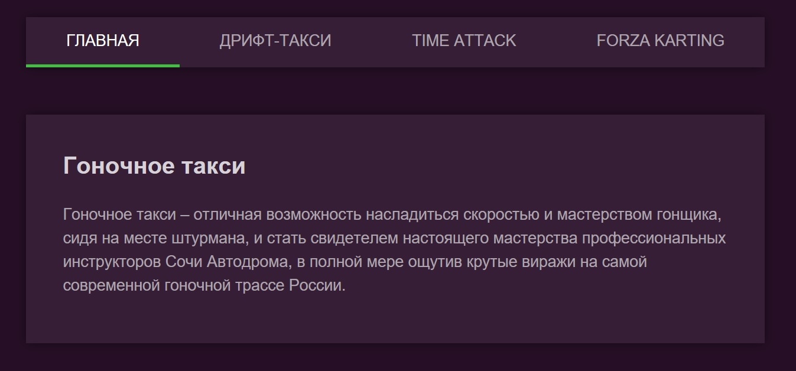

# Домашнее задание №1 к лекции «React Router»

[](https://ci.appveyor.com/project/yuriyvyatkin/ra-hw-9-1-nav-menu)

[Ссылка на Github Pages](https://yuriyvyatkin.github.io/ra-hw-9.1-nav-menu/)

Навигационное меню
===

Необходимо реализовать меню для сайта гоночного такси с пунктами «Главная», «Дрифт-такси», «Time Attack» и «Forza Karting». При переходе на страницу соответствующий пункт меню должен подсветиться:



## Описание компонента

Компонент должен создавать HTML-разметку вида:
```html
<nav class="menu">
  <a class="menu__item" href="/">Главная</a>
  <a class="menu__item" href="/drift">Дрифт-такси</a>
  <a class="menu__item" href="/timeattack">Time Attack</a>
  <a class="menu__item" href="/forza">Forza Karting</a>
</nav>
```
Активный пункт меню помечается классом `menu__item-active`.

## Реализация

Необходимо реализовать компонет `Menu`.

Воспользуйтесь готовым файлом `App.js` и стилями `css/index.css` из данного каталога в качестве отправной точки (замените ими те, что создаются в create-react-app).

**Обратите внимание**: в файлах `App.js` расположено несколько компонентов не потому, что так нужно делать, а для вашего удобства (чтобы вам было удобнее копировать). Будет хорошо, если в своём решении вы разнесёте их по разным файлам.
